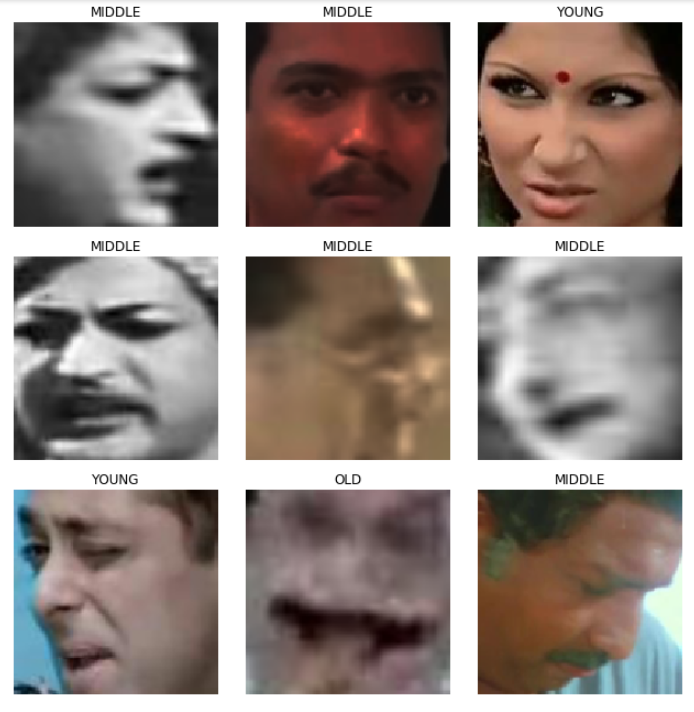

# Age Detection of Indian Actors using fastai

*This repo aims to create an image classifier to tell, given an image of an Indian Actor, whether s/he is young, middle-aged or old. fastai is used to build a CNN Classifier to accomplish this task. This classifier is built for making predictions on test images in [this hackathon](https://datahack.analyticsvidhya.com/contest/practice-problem-age-detection/).*
___

**About the dataset**

Indian Movie Face database (IMFDB) is a large unconstrained face database consisting of 34512 images of 100 Indian actors collected from more than 100 videos. All the images are manually selected and cropped from the video frames resulting in a high degree of variability in terms of scale, pose, expression, illumination, age, resolution, occlusion, and makeup. IMFDB is the first face database that provides a detailed annotation of every image in terms of age, pose, gender, expression and type of occlusion that may help other face related applications. For more details about the data set, read [here](http://cvit.iiit.ac.in/projects/IMFDB/). Here's a glimpse at a few sample faces with their labels from the dataset.

**Data**

The dataset is cleaned and formatted to give you a total of 26742 images with 19906 images in train and 6636 images in test.

The task is to predict the age of a person from his or her facial attributes. For simplicity, the problem has been converted to a multiclass problem with classes as Young, Middle and Old.

The attributes of data are as follows:

- ID – Unique ID of image

- Class – Age bin of person in image
___

## Solution Approach

We will be using fastai to build a model for performing this image classification. 

We will create a CNN Learner, tune the learning rate and use prebuilt model resnet50 for classifying the images. (I tried both resnet18 and resnet34 but those models didn't have enough capacity to differentiate between these classes, hence upscaled to resnet50).

### Getting fastai in Google Colab

In order to be able to use fastai in Google Colab environment, run the following command and by navigating to the **Runtime** option in toolbar, click on the **Change Runtime Type** option and select GPU from the new Form that pops up and make sure to uncheck "Omit Codecell output while saving this notebook" option. More support [here.](https://course.fast.ai/start_colab.html)

___

## Data Preparation and Loading Data

One of the crucial steps when building an Artificial Neural Network for doing an ML task is to load the data in a systematic way and pass it to the model for traiing.

fastai makes it very easy to load data progressively in batches and provides a good API to load data having different formats. 

eg. You can load data from 
- **csv_file**: This is how we are going to load our data. The images are provided in a folder and the labels/classes for the same are provided in a csv file. 

- **from_df**: If we have a pandas dataframe that holds the image names, then we can create an `ImageList` object which can then be used to create a DataBunch.

- **from_folder**: If the structure of data is in the format similar to imagenet i.e. train and test folders are separate and train contains subfolder of each class which holds instances of images from that class, then this is the goto function for loading data.
___

Currently, we will create an ImageList object from csv file provided and also add a test set to it. Then we will create an ImageDataBunch from this list to feed the model.

### Image Augmentation
It is a technique in which the images are modified in some small way to create new images so that our model can learn from a new set of data in addition to the current set. This is a common technique which is used to expand our trainset in case we have limited training data or so. 

The transformation functions in fastai facilitate easy use of transforms in order to augment a set of images, some of which are as follows (these are the ones I used for this classification task).

- **[brightness](https://docs.fast.ai/vision.transform.html#_brightness)**: Given a range of brightness values and a probability(p) of applying these to the image, it returns a brightened image (with probability p) which has it's intensity between min and max specified intensities. 

- **[contrast](https://docs.fast.ai/vision.transform.html#_contrast)**: Similar to brightness, provide a range of contrast and a probability of application of this transform.

- **[rotate](https://docs.fast.ai/vision.transform.html#_rotate)**: Given a range of degrees of rotation as a tuple and a probability, it applies a uniformly randomly selected angle from that range, rotates the image(with probability p) and returns the same.

- **[jitter](https://docs.fast.ai/vision.transform.html#_jitter)**: This is a method of unsharpening the image i.e. it takes the image and within small regions of the image, it substitutes pixels from it's local neighborhoods. This gives a blurred version of the image. The amount of blurriness is controlled by the magnitude parameter which can be specified as a range along with the probability of application of this transform p.

This is all for the data preparation step. After this, we wil create a learner object to train our model.
___

## Model Building and Training

Transfer Learning is the savior. It is the method where we take a pretrained architecture and modify it to suit our classification task.

In ANNs layers, the learning happens in a hierarchical fashion. So, if we already have some architectures like ResNet and VGG which are trained on a dataset like ImageNet which has a million images and a thousand classes, then it has seen enough data to observe a lot of things in nature and learned to extract edges, corners, curves etc. of which we can make use of.

Hence we'll define a learner object based upon a pretrained architecture and use it to train our model further. With fastai's `cnn_learner` module, this task becomes quite easy. We just have to specify the databunch on which we wanna train, the pretrained model and the metrics we wish to monitor during training.

For this example, let's use a resnet34 model and monitor the accuracy as we go training the architecture.
___

## Model Evaluation and Prediction

The validation dataset can be used in order to evaluate the performance of our model since it was never used before in training. 

fastai allows us to easily achieve this with the `ClassificationInterpretation` class and you could create an instance of this class using the learn object and optionally a test dataset.

With this class you can interpret the results in the following ways.
- `interp.top_losses()` - This function returns the losses and indices of the same in a descending order of losses i.e. The image for which the loss was highest is the first and the one for which it's lowest is the last.

- `inter.plot_top_losses(n)` - It plots the top n images whose loss is the highest. This can help understand where our classifier makes mistakes more often and what kind of classes does it find difficult to classify.

- `interp.most_confused()` - This method tells which two classes get mixed up more often and give the model a hard time in prediction.

In the above points, interp is an instance of ClassificationInterpretation class which is loaded with the learner that we've created previously.
___

## Results
 
The classification accuracy was XXX

Also, as on 28th Feb 2020, this was how my submission stood on the leaderboard.

fastai is an easily comprehensible, conveniently applicable and substantially efficient library which helped me easily get into the top 10% of submissions in the competition. I recommend it to use for everyone especially for it's simplicity and efficiency.
